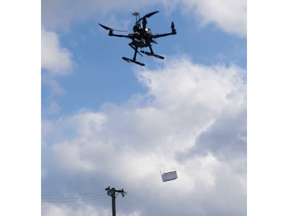

# SLTS Control

This C++ package implements the exponentially stable robust following controller for **Data-Driven and Robust Path-following Control of a Quadrotor Slung Load Transport System**.



## Dependencies

### Main controller library

The only dependency of the main controller library is the [Eigen](https://gitlab.com/libeigen/eigen) linear algebra library. You can install it with

``` bash
sudo apt-get install libeigen3-dev
```

### Tests

The tests additionally depend on [Googletest](https://github.com/google/googletest) and [rapidjson](https://github.com/Tencent/rapidjson/releases). You can install each of these libraries with

``` bash
sudo apt-get install rapidjson-dev
sudo apt-get install libgtest-dev
```

## Building

At the root of this package, run

``` bash
cmake -S . -B build
cmake --build build
sudo cmake --install build
```

Tests are not built by default. Testing is covered in `tests/testing.md`.

## Brief Usage Notes

This section walks you through how to use this controller library in your C++ code.

1. Find this package and link your executable to it in CMake

    ``` cmake
    find_package(slts_control REQUIRED)

    add_executable(my_controller path/to/my_controller.cpp)
    target_link_libraries(my_controller slts_control::robust_tracker)
    ```
2. Include the required headers

    ``` C++
    #include "slts_control/definitions.h"
    #include "slts_control/robust_tracker.h"
    ```

3. Construct the controller object

    ``` C++
    control::SLTSController ctl;
    ```

4. Construct the parameter structure and load it into the controller

    ``` C++
    control::SLTSController::Params params;
    params.uav_mass = 1.0;
    params.pld_mass = 0.5;
    // Fill in other fields
    
    if (!ctl.loadParams(params)) {
      // Handle the error appropriately 
    }
    ```
  
    * Optionally also load initial conditions

        ```  C++
        control::SLTSController::InitialConditions ics;
        ics.uav_pos << 0.0, 0.0, 0.5;
        // Fill in other fields
        if (!ctl.setInitialConditions(ics)) {
            // Handle the error appropriately
        }
        ```

5. Run the following functions upon each sensor update

    * Update UAV position

        ``` C++
        ctl.uav_pos() = gps_pos_reading;
        ```

    * Update UAV velocity

        ``` C++
        ctl.uav_vel() = gps_vel_reading:
        ```

    * Update UAV acceleration (Earth frame!!!)

        ``` C++
        ctl.uav_acc() = rotation_body_to_earth * imu_acc_reading;
        ```

    * Update vehicle actual thrust estimation. 
  
      > Good if you have instrumented motors and ESCs. If not, use the thrust magnitude, multiplied by the body-Z axis of the UAV

        ``` C++
        ctl.thrust_act() = motor_thrust;
        ```

    * Update payload position relative to UAV. Run either:

        ``` C++
        // This function uses numerical differentiation to compute payload velocity relative
        // to UAV
        ctl.setPayloadRelativePosition(
            dt,           // Time interval for numerical differentiation
            pld_rel_pos,  // Payload position relative to UAV
            control::NumDiffMode::Forward);  // Mode of numerical differentiation

        ```

        or

        ``` C++
        // This function sets payload relative position AND velocity, assuming payload
        // relative velocity is computed by some other means, e.g. optical flow or a
        // state estimator
        ctl.setPayloadRelativePositionAndVelocity(pld_rel_pos, pld_rel_vel);
        ```

6. Set translational errors

    ``` C++
    ctl.setPayloadTranslationalErrors(
        pld_pos_err,        // Payload positional error
        pld_pos_err_rates,  // Derivative of payload position error (can be zeroed
                            // for little performance penalty)
        pld_vel_err,        // Payload velocity error
        pld_vel_sp);        // Payload velocity setpoint
    ```

7. Run the main function in a control loop

    ``` C++
    tracker.computeControlOutput(dt);
    ```

8. Read the thrust setpoint and forward it to actuators in the actuator loop

    ``` C++
    const Eigen::Vector3d thrust_setpoint = ctl.thrust_sp();
    motors.setThrust(thrust_setpoint); // Some magical actuator function
    ```

    Often it is necessary to convert the 3D thrust setpoint to a desired thrusting orientation and a scalar thrust value. Equation (11) in our paper tells you how to do that 

## Formula Reference

Refer to `docs/formula_reference.pdf`
